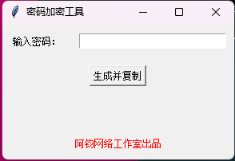

# 密码加密工具

## 项目概述

密码加密工具是一个基于 Tkinter 的图形界面应用，旨在帮助用户生成安全、复杂的加密密码。该工具使用 PBKDF2-HMAC-SHA256 算法进行密码加密，并确保生成的密码包含大写字母、小写字母、数字和符号。

## 特性

- **强密码生成**：使用 PBKDF2-HMAC-SHA256 算法，确保密码安全性。
- **图形用户界面**：使用 Tkinter 创建简洁易用的图形界面。
- **自动复制**：生成的加密密码会自动复制到剪贴板。
- **自定义长度**：可以自定义生成密码的长度（默认为16个字符）。

## 截图



## 安装

1. 克隆这个仓库：

   ```bash
   https://github.com/wsj66666612/password_hasher.git
   cd password-encryption-tool
   ```

2. 创建并激活虚拟环境（可选但推荐）：

   ```bash
   python -m venv venv
   source venv/bin/activate  # 对于Windows用户，使用 `venv\Scripts\activate`
   ```

3. 安装所需的依赖包：

   ```bash
   pip install -r requirements.txt
   ```

## 使用

1. 运行主程序：

   ```bash
   python password_hasher.py
   ```

2. 输入需要加密的密码，然后点击“生成并复制”按钮。生成的加密密码会显示在界面上，并自动复制到剪贴板。

## 代码示例

以下是主程序的代码示例：

```python
import hashlib
import base64
import tkinter as tk
from tkinter import messagebox
import pyperclip

FIXED_SALT = b"your_fixed_salt_here_black_hack_fack_mom_bitch_pussy_dick_sugar_daddy"

def hash_password(password: str, length: int = 16, iterations: int = 5000000) -> str:
    dk = hashlib.pbkdf2_hmac('sha256', password.encode(), FIXED_SALT, iterations)
    hash_b64 = base64.urlsafe_b64encode(dk).decode()
    hash_substr = hash_b64[:length]
    
    has_upper = any(c.isupper() for c in hash_substr)
    has_lower = any(c.islower() for c in hash_substr)
    has_digit = any(c.isdigit() for c in hash_substr)
    has_symbol = any(not c.isalnum() for c in hash_substr)
    
    if not (has_upper and has_lower and has_digit and has_symbol):
        return hash_password(hash_substr, length)

    return hash_substr

def generate_and_copy():
    password = entry.get()
    if not password:
        messagebox.showerror("输入错误", "请输入一个密码")
        return
    encrypted_password = hash_password(password)
    result_label.config(text=encrypted_password)
    pyperclip.copy(encrypted_password)
    messagebox.showinfo("复制成功", "加密后的密码已复制到剪贴板")

root = tk.Tk()
root.title("密码加密工具")

tk.Label(root, text="输入密码：").grid(row=0, column=0, padx=10, pady=10)
entry = tk.Entry(root, width=30)
entry.grid(row=0, column=1, padx=10, pady=10)

generate_button = tk.Button(root, text="生成并复制", command=generate_and_copy)
generate_button.grid(row=1, column=0, columnspan=2, padx=10, pady=10)

result_label = tk.Label(root, text="", fg="blue")
result_label.grid(row=2, column=0, columnspan=2, padx=10, pady=10)

authentic_label = tk.Label(root, text="阿钧网络工作室出品", fg="red")
authentic_label.grid(row=3, column=0, columnspan=2, padx=10, pady=10)

root.mainloop()
```

## 贡献

欢迎任何形式的贡献！你可以通过以下方式贡献：

1. 提交 Bug 报告或功能请求。
2. 提交 Pull Request 来修复 Bug 或添加新功能。
3. 改进文档。

## 许可证

该项目基于 MIT 许可证。详细信息请参见 [LICENSE](LICENSE) 文件。

## 联系方式

如有任何问题或建议，请通过 [yizhiajun@gmail.com] 联系我。
